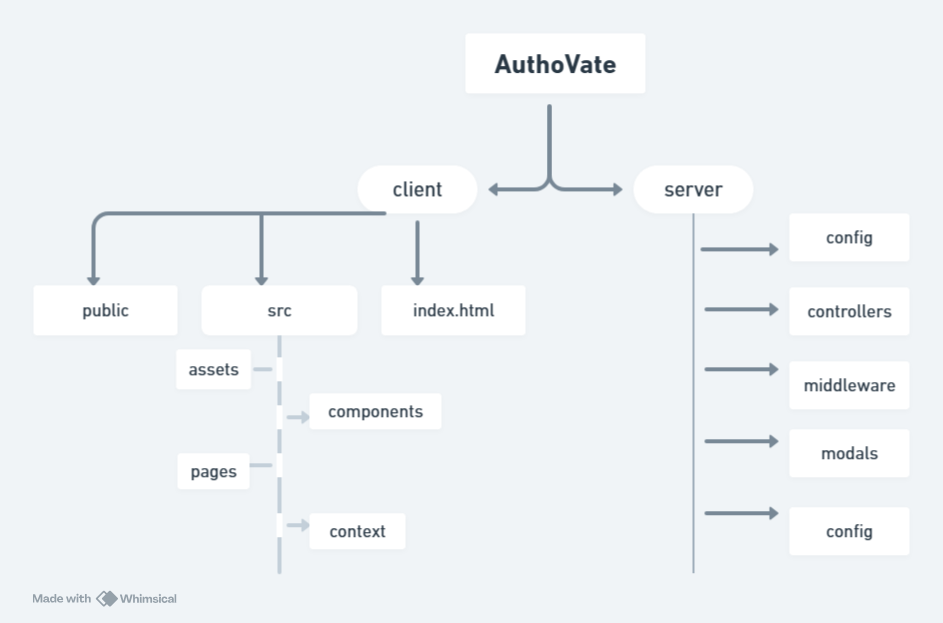

# AuthoVate

AuthoVate is a robust MERN stack application that provides secure user authentication with features like signup, login, OTP verification, and password reset, all powered by JWT (JSON Web Tokens).

---

## 🛠️ Features
- **User Signup**: Register new users with validation.
- **User Login**: Authenticate users with a secure login system.
- **JWT Authentication**: Generate and validate JWT tokens for secure sessions.
- **Password Encryption**: User passwords are hashed using `bcrypt` for security.
- **OTP Verification**: Verify user email or phone using One-Time Password (OTP).
- **Reset Password**: Secure password reset functionality with token validation.

---

## 🏗️ Tech Stack
- **Frontend**: React.js
- **Backend**: Node.js, Express.js
- **Database**: MongoDB
- **Authentication**: JSON Web Tokens (JWT)
- **Email/OTP Service**: Nodemailer or equivalent SMTP service for sending OTPs.

## Workflow 
